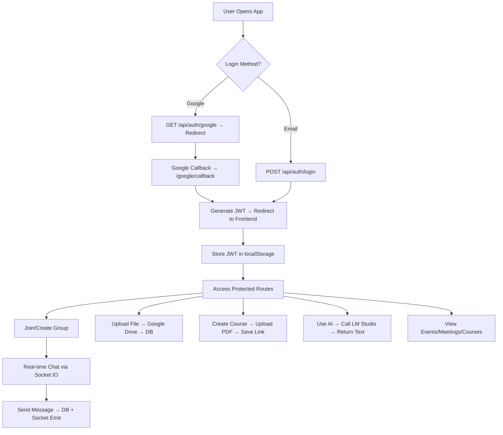

# StudyHive – Full Backend Code Explanation

#### **Project Overview**

**StudyHive** is a **full-stack collaborative learning platform** where students can:

- Create/join **study groups**
- **Chat in real time** with group members
- Share **files** (via Google Drive)
- Schedule **meetings & events**
- Create and share **courses/resources**
- Use **AI tools** (summarization, study plans, explanations)
- Authenticate via **Email/Password or Google OAuth**

This is the **backend** (Node.js + Express + MongoDB + Socket.IO + Google APIs), running on `localhost:5000`.

---

## **1. Configuration Files (`/config`)**

These set up essential services.

---

### `authConfig.js` – Google OAuth Setup

```js
passport.use(new GoogleStrategy({ ... }, async (accessToken, refreshToken, profile, done) => { ... }))
```

- Uses **Passport.js** with **Google OAuth 2.0** strategy.
- On login:
  1. Checks if user exists by `googleId` → logs in.
  2. If not, checks by `email` → links Google account.
  3. If new → creates user with `googleId`, `name`, `email`, `password: null`.
- Returns user to `done()` → used in callback route.

---

### `db.js` – MongoDB Connection

```js
await mongoose.connect(process.env.MONGO_URI);
```

- Connects to **MongoDB Atlas** (or local) using `MONGO_URI` from `.env`.
- Exits process on failure.

---

### `dotenv.js` – Environment Validation

```js
requiredEnv.forEach(varName => { if (!process.env[varName]) throw Error(...) })
```

- Ensures critical `.env` vars are present:
  - `MONGO_URI`, `JWT_SECRET`, `GOOGLE_CLIENT_ID`, etc.
- Fails fast if missing.

---

### `googleDrive.js` – Google Drive Integration

```js
const jwtClient = new JWT({ email, key, scopes: ["drive"] });
const drive = google.drive({ version: "v3", auth: jwtClient });
```

- Uses **service account** (not user OAuth) to upload files to a **shared StudyHive folder**.
- `STUDYHIVE_FOLDER_ID` = parent folder in Drive.
- Files are uploaded as **PDFs**, public link returned.

---

### `socket.js` – Real-Time Chat (Socket.IO)

```js
io.on('connection', socket => { ... })
```

- Initializes **Socket.IO** on the HTTP server.
- Events:
  - `joinGroup(groupId)` → joins room.
  - `sendMessage` → broadcasts to group.
  - `deleteMessage`, `reactToMessage` → real-time updates.
- CORS restricted to `localhost:5173` (frontend).

---

## **2. Controllers (`/controllers`)**

Handle business logic per feature.

---

### `authController.js` – User Auth

| Route                  | Function                                                              |
| ---------------------- | --------------------------------------------------------------------- |
| `POST /signup`         | Creates user with hashed password                                     |
| `POST /login`          | Validates password → returns JWT                                      |
| `GET /google/callback` | After Google login → generates JWT → redirects to frontend with token |

> Uses `generateToken(user)` → JWT with `id`, `email`, expires in **6 hours**.

---

### `chatController.js` – Group Chat

- `getMessages`: Fetch all messages in a group (populated with user name).
- `createMessage`: Save new message.
- `deleteMessage`: Only owner can delete.
- `reactToMessage`: Add/update reaction (like/dislike).

> Real-time via **Socket.IO** (`newMessage`, `messageDeleted`, etc.)

---

### `courseController.js` – Course Sharing

- `fetchCourses`: Get all public courses.
- `createCourse`:
  - Uploads **PDF resource** to Google Drive.
  - Stores **public link** in DB.
  - Saves course with `image` (ImgBB URL), `link`, `categories`, etc.
- `updateCourse`, `deleteCourse`: Author-only.

---

### `eventController.js` – Personal Calendar

- Events tied to **user**, not group.
- Types: `homework`, `exam`, `project`
- Status: `not_started`, `in_progress`, `completed`
- CRUD operations.

---

### `fileController.js` – Group File Sharing

- Uploads **any file** (base64) → Google Drive.
- Saves metadata in MongoDB: `name`, `driveFileId`, `url`.
- Only uploader can delete.

---

### `groupController.js` – Study Groups

| Action               | Permission                           |
| -------------------- | ------------------------------------ |
| Create               | Any user (becomes **host**)          |
| Edit/Delete          | Host only                            |
| Join                 | Public: auto; Private: via `groupId` |
| Remove/Block         | Host or Moderator                    |
| Promote to Moderator | Host only                            |

- `groupId`: Random 8-char string (not Mongo `_id`)
- `members`: Array of `{ userId, role }`

---

### `meetingController.js` – Group Meetings

- Scheduled via `dateTime`.
- Only **host** can create/edit/delete.
- Fetched per group.

---

### `userController.js` – Profile Management

- `getUserProfile`: Returns safe user data.
- `updateProfile`: Name, email, interests.
- `addPassword`: For Google users → set password.
- `changePassword`: Requires current password.
- `deleteAccount`: Permanent delete.

---

### `aiController.js` – Local AI (LM Studio)

- Runs **LLaMA-2-7B** locally via **LM Studio** (`http://localhost:1234`)
- Endpoints:
  - `/summarize` → summarize text
  - `/study-plan` → generate schedule
  - `/explain` → explain topic simply
- Uses `axios` to call local OpenAI-compatible API.

---

## **3. Models (`/models`)**

MongoDB schemas.

| Model       | Key Fields                                                    |
| ----------- | ------------------------------------------------------------- |
| **User**    | `name`, `email`, `password` (hashed), `googleId`, `interests` |
| **Group**   | `name`, `groupId` (custom), `members[]`, `host`, `isPublic`   |
| **Message** | `groupId`, `userId`, `content`, `reactions[]`                 |
| **Course**  | `name`, `resource` (Drive link), `author`, `categories`       |
| **Event**   | `name`, `dueDate`, `userId`, `status`                         |
| **File**    | `groupId`, `userId`, `driveFileId`, `url`                     |
| **Meeting** | `groupId`, `dateTime`, `createdBy`                            |

---

## **4. Routes (`/routes`)**

All protected by `authMiddleware` (JWT).

| Prefix          | Routes                                             |
| --------------- | -------------------------------------------------- |
| `/api/auth`     | `/signup`, `/login`, `/google`, `/google/callback` |
| `/api/groups`   | CRUD + join/remove/block                           |
| `/api/chat`     | Messages + reactions                               |
| `/api/courses`  | Create/share courses                               |
| `/api/files`    | Upload/delete files                                |
| `/api/events`   | Personal tasks                                     |
| `/api/meetings` | Group meetings                                     |
| `/api/user`     | Profile, password                                  |
| `/api/ai`       | Summarize, plan, explain                           |

---

## **5. Middleware**

### `authMiddleware.js`

```js
const token = req.header("Authorization")?.replace("Bearer ", "");
jwt.verify(token, JWT_SECRET) → req.user = decoded
```

- Protects all routes except `/auth` login/signup.

---

## **6. Utilities**

### `generateToken.js`

```js
jwt.sign({ id, email }, JWT_SECRET, { expiresIn: "6h" });
```

- Generates **JWT** for session.

---

## **7. Server Entry (`server.js`)**

```js
const app = express();
const server = http.createServer(app);
const io = initSocket(server);

app.use(cors(...));
app.use(passport.initialize());
app.use("/api/...", routes);

connectDB();
server.listen(PORT);
```

- Sets up:
  - Express + CORS
  - JSON body parsing (10MB limit)
  - Passport
  - All routes
  - Socket.IO
  - DB connection

---

## **Overall Application Flow**



---

## **Tech Stack Summary**

| Layer            | Technology                     |
| ---------------- | ------------------------------ |
| **Backend**      | Node.js, Express               |
| **Database**     | MongoDB (Mongoose)             |
| **Auth**         | JWT + Google OAuth (Passport)  |
| **Real-time**    | Socket.IO                      |
| **File Storage** | Google Drive (Service Account) |
| **AI**           | LM Studio (LLaMA-2-7B local)   |
| **Env**          | dotenv                         |
| **CORS**         | Whitelisted `localhost:5173`   |

---

## **Security Notes**

- JWT expires in **6 hours**
- Passwords hashed with **bcrypt**
- Google OAuth uses **service account** for Drive (secure)
- All routes except auth require **JWT**
- File uploads limited to **10MB**
- Input validation in controllers

---

## **Potential Improvements**

1. **Rate limiting** on AI endpoints
2. **Pagination** for messages/courses
3. **Search** for groups/courses
4. **Notifications** (email/Socket)
5. **File type validation**
6. **Image upload** for courses (currently uses external ImgBB)

---
