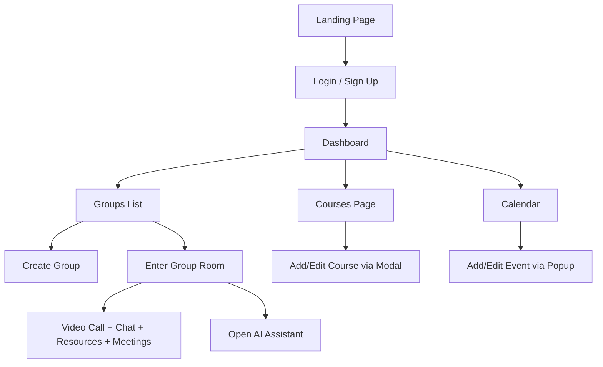

# **StudyHive Frontend Overview**

The frontend of **StudyHive** is a modern, responsive **React.js** application built with **Tailwind CSS** and **custom CSS variables** for theming. It provides a rich, interactive learning and collaboration platform for students, featuring group study rooms, AI-powered tools, calendars, chat, video calls, and resource sharing.

---

### Core Technologies & Architecture

| Technology                | Purpose                                                     |
| ------------------------- | ----------------------------------------------------------- |
| **React.js**              | Component-based UI, state management                        |
| **React Router**          | Client-side routing (`/dashboard`, `/groups`, `/group/:id`) |
| **Tailwind CSS**          | Utility-first styling with responsive design                |
| **CSS Custom Properties** | Theming (`--primary`, `--bg`, `--text`, etc.)               |
| **Lucide Icons**          | Lightweight, consistent iconography                         |
| **date-fns**              | Date formatting & manipulation                              |
| **Socket.IO**             | Real-time chat updates                                      |
| **Jitsi Meet API**        | Embedded video conferencing                                 |
| **ImgBB API**             | Image hosting for course uploads                            |
| **react-hot-toast**       | User feedback notifications                                 |

---

### Key Components Breakdown

#### 1. **Common UI Components**

| Component     | Purpose                                                                                                                                                                              |
| ------------- | ------------------------------------------------------------------------------------------------------------------------------------------------------------------------------------ |
| `Navbar.jsx`  | Top navigation bar with **logo**, **mobile menu toggle**, and **Login/Sign Up** CTAs. Responsive design with hamburger menu on mobile.                                               |
| `Sidebar.jsx` | Persistent left sidebar for authenticated users. Includes navigation to **Dashboard, Groups, Courses, Profile**, user avatar, and **Sign Out**. Mobile-friendly with overlay toggle. |

---

#### 2. **Modals & Popups**

| Component                     | Functionality                                                                                                   |
| ----------------------------- | --------------------------------------------------------------------------------------------------------------- |
| `AIModal.jsx`                 | Full-screen AI assistant with 3 tabs: **Summarize**, **Study Plan**, **Explain Topic**. Uses backend AI APIs.   |
| `CourseModal.jsx`             | Create/Edit courses with **image upload (ImgBB)**, **PDF resource**, **categories/tags**, link, and validation. |
| `CreateGroupModal.jsx`        | Create or edit study groups (name, description, public/private).                                                |
| `DeleteConfirmationModal.jsx` | Reusable confirmation dialog for destructive actions.                                                           |
| `EventAddPopup.jsx`           | Add new calendar events (homework, exam, project) with date/time, group, and status.                            |
| `EventDetailsModal.jsx`       | Edit or delete existing events. Includes delete confirmation.                                                   |

---

#### 3. **Interactive & Real-Time Features**

| Component             | Features                                                                                                                                    |
| --------------------- | ------------------------------------------------------------------------------------------------------------------------------------------- |
| `Calendar.jsx`        | **Month/Week view toggle**, event display with **status-based color coding** (`not_started`, `in_progress`, `completed`). Clickable events. |
| `ChatBox.jsx`         | Real-time group chat using **Socket.IO**. Supports **send/delete messages**, **reactions (like)**, and auto-scroll.                         |
| `VideoConference.jsx` | Embedded **Jitsi Meet** video room per group. Join/leave controls.                                                                          |
| `MeetingTime.jsx`     | Host-only meeting scheduler. Add/edit/delete meeting times.                                                                                 |
| `StudyResources.jsx`  | File sharing (upload/download/delete). Only uploader can delete.                                                                            |

---

Here's the **completed and enhanced** version of the **Page-Level Components** section:

---

#### 4. **Page-Level Components**

| Component          | Role                                                                                                                                                                                                                                                                                                                                                                                                                                                                                                                                                                                                                                                                                                                                                                          |
| ------------------ | ----------------------------------------------------------------------------------------------------------------------------------------------------------------------------------------------------------------------------------------------------------------------------------------------------------------------------------------------------------------------------------------------------------------------------------------------------------------------------------------------------------------------------------------------------------------------------------------------------------------------------------------------------------------------------------------------------------------------------------------------------------------------------- |
| `GroupList.jsx`    | Displays a responsive **grid of study groups** with:  • **Group name & description**  • **Member count** with `Users` icon  • **Creation date** formatted via `date-fns`  • **"Active" status** badge  • **Clickable card** navigates to `/group/:id` using `useNavigate()`                                                                                                                                                                                                                                                                                                                                                                                                                                                                                    |
| `GroupRoom.jsx`    | **Central hub** for group collaboration. Integrates multiple interactive features:   → **`VideoConference`** – Embedded Jitsi Meet room (`StudyHive-{groupId}`)  → **`ChatBox`** – Real-time messaging with Socket.IO, reactions, delete  → **`MeetingTime`** – Host schedules/edits/deletes upcoming meetings  → **`StudyResources`** – File upload/download/delete (PDFs, notes)  → **Member List Modal** – Host can:  &nbsp;&nbsp;• View avatars & roles  &nbsp;&nbsp;• Promote to **Moderator**  &nbsp;&nbsp;• **Remove** or **Block** members  → **Floating AI Button** – Opens full-screen `AIModal` for AI tools  → **Sidebar Integration** – Persistent navigation on desktop  → **Loading & Error States** with `toast` feedback |
| `Dashboard.jsx`    | User’s home after login. Likely includes:  • Welcome message with user name  • Quick stats (groups joined, upcoming events)  • **Calendar preview**  • **Recent activity** feed  • CTA buttons: “Create Group”, “Join Group”, “Add Event”                                                                                                                                                                                                                                                                                                                                                                                                                                                                                                                      |
| `Courses.jsx`      | Browse, search, and filter **user-created courses**. Features:  • Grid/list view  • Category & tag filters  • **Add Course** button → opens `CourseModal`  • Clickable cards → course detail page                                                                                                                                                                                                                                                                                                                                                                                                                                                                                                                                                                 |
| `CourseDetail.jsx` | Full view of a course:  • Title, description, image  • Embedded **resource PDF** or **external link**  • Tags & categories  • **AI Summarize** button (pre-filled with course content)                                                                                                                                                                                                                                                                                                                                                                                                                                                                                                                                                                            |
| `Profile.jsx`      | User settings:  • Edit name, email, avatar  • Update **learning interests** (used by AI Study Plan)  • View **joined groups**, **created courses**, **event history**                                                                                                                                                                                                                                                                                                                                                                                                                                                                                                                                                                                                |

This structure ensures **modularity**, **reusability**, and a **smooth user journey** from onboarding to deep collaboration.

---

### User Flow Summary

---

### Design & UX Highlights

- **Dark Mode Ready** via CSS variables
- **Fully Responsive** (mobile-first breakpoints)
- **Accessible** with `aria-labels`, focus states, and semantic HTML
- **Real-time Feedback** with `toast` notifications
- **Smooth Animations** using `transition-colors`, `backdrop-blur`, and mobile menu slide-in
- **Consistent Branding**: "StudyHive" logo with accent color

---

### Security & Data Handling

- **LocalStorage** used for `token` and `user` (persists login)
- **File Validation**: Size & type checks for images (5MB, JPEG/PNG) and PDFs (10MB)
- **Image Upload via ImgBB** (external hosting)
- **Socket.IO with credentials** for secure real-time communication

---

### Future-Proof & Scalable

- **Modular components** encourage reuse
- **API abstraction layer** (`../api/*`) separates concerns
- **State management** ready for **Zustand** or **Redux** if scaled
- **AI features** are modular and expandable

---

### Summary: What StudyHive Frontend Delivers

> **A collaborative, AI-enhanced study platform** where students can:
>
> - Join or create **study groups**
> - **Video chat**, **chat in real-time**, and **share files**
> - Schedule **meetings** and track **events**
> - Use **AI to summarize notes, generate study plans, or explain concepts**
> - Manage **courses** with rich metadata and resources
> - Stay organized with a **beautiful, responsive calendar**

---

**StudyHive** is not just a study tool — it's a **digital study hive** buzzing with collaboration, intelligence, and productivity.
