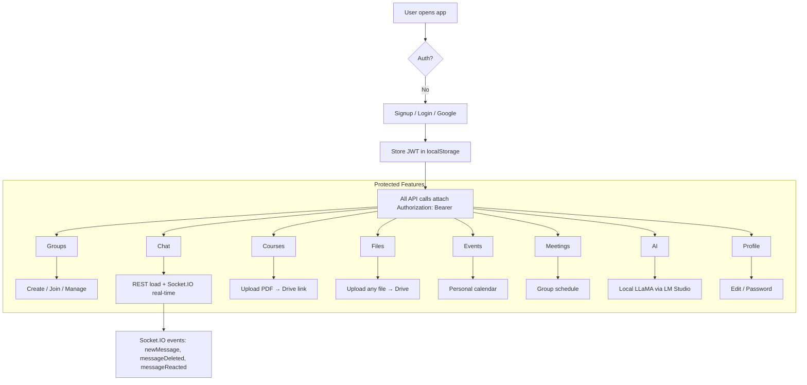

# **Frontend API layer**

---

## 1. `aiApi.js` – AI-powered study tools

| Function                                 | HTTP                      | Body                      | Returns              | Backend                          |
| ---------------------------------------- | ------------------------- | ------------------------- | -------------------- | -------------------------------- |
| `summarizeContent(content)`              | `POST /api/ai/summarize`  | `{ content }`             | `summary` string     | `aiController.summarizeContent`  |
| `generateStudyPlan(interests, duration)` | `POST /api/ai/study-plan` | `{ interests, duration }` | `plan` string        | `aiController.generateStudyPlan` |
| `explainTopic(topic)`                    | `POST /api/ai/explain`    | `{ topic }`               | `explanation` string | `aiController.explainTopic`      |

**Common pattern**

```js
const token = localStorage.getItem("token");
fetch(url, {
  method: "POST",
  headers: {
    "Content-Type": "application/json",
    Authorization: `Bearer ${token}`,
  },
  body: JSON.stringify(payload),
});
```

- JWT is sent on **every** call → backend `authMiddleware` validates it.
- Errors are turned into `throw new Error(...)` so UI can `catch` them.

---

## 2. `authApi.js` – Sign-up / Sign-in

| Function             | HTTP                                  | Body                              | Returns         | Backend                  |
| -------------------- | ------------------------------------- | --------------------------------- | --------------- | ------------------------ |
| `signup(userData)`   | `POST /api/auth/signup`               | `{name,email,password,interests}` | `{token, user}` | `authController.signup`  |
| `login(credentials)` | `POST /api/auth/login`                | `{email,password}`                | `{token, user}` | `authController.login`   |
| `googleLogin()`      | **Redirect** → `GET /api/auth/google` | –                                 | –               | Passport Google strategy |

- After a successful login/signup the **JWT** is stored in `localStorage`.
- `googleLogin` just navigates the browser – the OAuth flow finishes at `/auth/google/success?token=…` (see backend `googleCallback`).

---

## 3. `chatApi.js` – Real-time group chat (REST part)

| Function                              | HTTP                          | Params / Body           | Returns           | Backend                         |
| ------------------------------------- | ----------------------------- | ----------------------- | ----------------- | ------------------------------- |
| `getMessages(groupId)`                | `GET /api/chat/:groupId`      | –                       | array of messages | `chatController.getMessages`    |
| `createMessage(groupId, content)`     | `POST /api/chat`              | `{groupId, content}`    | new message       | `chatController.createMessage`  |
| `deleteMessage(messageId)`            | `DELETE /api/chat/:messageId` | –                       | `{messageId}`     | `chatController.deleteMessage`  |
| `reactToMessage(messageId, reaction)` | `POST /api/chat/react`        | `{messageId, reaction}` | updated reaction  | `chatController.reactToMessage` |

> **Note:** The **real-time** part (`newMessage`, `messageDeleted`, `messageReacted`) is handled by **Socket.IO** (see `socket.js` on backend). The REST API is only for initial load / persistence.

---

## 4. `courseApi.js` – Course marketplace

| Function                   | HTTP                            | Body                                           | Returns          | Backend                         |
| -------------------------- | ------------------------------- | ---------------------------------------------- | ---------------- | ------------------------------- |
| `fetchCourses()`           | `GET /api/courses`              | –                                              | array of courses | `courseController.fetchCourses` |
| `createCourse(courseData)` | `POST /api/courses`             | full course JSON (incl. `resourceData` base64) | new course       | `courseController.createCourse` |
| `updateCourse(courseData)` | `PUT /api/courses`              | same shape, must include `courseId`            | updated course   | `courseController.updateCourse` |
| `deleteCourse(courseId)`   | `DELETE /api/courses/:courseId` | –                                              | success msg      | `courseController.deleteCourse` |

- `resourceData` → **PDF file encoded as base64** → backend uploads to Google Drive.

---

## 5. `eventApi.js` – Personal calendar

| Function                     | HTTP                     | Body               | Returns       | Backend                       |
| ---------------------------- | ------------------------ | ------------------ | ------------- | ----------------------------- |
| `fetchEvents()`              | `GET /api/events`        | –                  | user events   | `eventController.getEvents`   |
| `createEvent(eventData)`     | `POST /api/events`       | `{name,dueDate,…}` | new event     | `eventController.createEvent` |
| `updateEvent(id, eventData)` | `PUT /api/events/:id`    | partial updates    | updated event | `eventController.updateEvent` |
| `deleteEvent(id)`            | `DELETE /api/events/:id` | –                  | success       | `eventController.deleteEvent` |

---

## 6. `fileApi.js` – Group file sharing

| Function                    | HTTP                        | Body                                     | Returns         | Backend                     |
| --------------------------- | --------------------------- | ---------------------------------------- | --------------- | --------------------------- |
| `getFiles(groupId)`         | `GET /api/files/:groupId`   | –                                        | array of files  | `fileController.getFiles`   |
| `uploadFile(groupId, file)` | `POST /api/files`           | `{groupId, fileName, fileData}` (base64) | new file record | `fileController.uploadFile` |
| `deleteFile(fileId)`        | `DELETE /api/files/:fileId` | –                                        | success         | `fileController.deleteFile` |

**Upload flow**

1. `FileReader` → `readAsDataURL` → `data:image/...;base64,XXXX`
2. Strip prefix → send **pure base64**
3. Backend → Google Drive → returns public link.

---

## 7. `groupApi.js` – Study-group management

| Function                                  | HTTP                               | Body                          | Returns       | Backend                             |
| ----------------------------------------- | ---------------------------------- | ----------------------------- | ------------- | ----------------------------------- |
| `fetchUserGroups()`                       | `GET /api/groups/user`             | –                             | user’s groups | `groupController.fetchUserGroups`   |
| `fetchPublicGroups()`                     | `GET /api/groups/public`           | –                             | public groups | `groupController.fetchPublicGroups` |
| `createGroup(data)`                       | `POST /api/groups`                 | `{name,description,isPublic}` | new group     | `groupController.createGroup`       |
| `editGroup(data)`                         | `PUT /api/groups`                  | `{groupId,name,…}`            | updated group | `groupController.editGroup`         |
| `deleteGroup(groupId)`                    | `DELETE /api/groups/:groupId`      | –                             | success       | `groupController.deleteGroup`       |
| `joinGroup(groupId)`                      | `POST /api/groups/join`            | `{groupId}`                   | group         | `groupController.joinGroup`         |
| `removeMember(groupId,memberId)`          | `POST /api/groups/remove`          | `{groupId,memberId}`          | group         | `groupController.removeMember`      |
| `blockMember(groupId,memberId)`           | `POST /api/groups/block`           | `{groupId,memberId}`          | group         | `groupController.blockMember`       |
| `updateMemberRole(groupId,memberId,role)` | `POST /api/groups/role`            | `{groupId,memberId,role}`     | group         | `groupController.updateMemberRole`  |
| `getGroupMembers(groupId)`                | `GET /api/groups/:groupId/members` | –                             | members array | `groupController.getGroupMembers`   |

---

## 8. `meetingApi.js` – Group meeting scheduler

| Function                             | HTTP                              | Body                   | Returns         | Backend                           |
| ------------------------------------ | --------------------------------- | ---------------------- | --------------- | --------------------------------- |
| `getMeetings(groupId)`               | `GET /api/meetings/:groupId`      | –                      | meetings        | `meetingController.getMeetings`   |
| `createMeeting(groupId, dateTime)`   | `POST /api/meetings`              | `{groupId,dateTime}`   | new meeting     | `meetingController.createMeeting` |
| `updateMeeting(meetingId, dateTime)` | `PUT /api/meetings`               | `{meetingId,dateTime}` | updated meeting | `meetingController.updateMeeting` |
| `deleteMeeting(meetingId)`           | `DELETE /api/meetings/:meetingId` | –                      | success         | `meetingController.deleteMeeting` |

---

## 9. `userApi.js` – Profile & account

| Function                                        | HTTP                          | Body                     | Returns      | Backend                         |
| ----------------------------------------------- | ----------------------------- | ------------------------ | ------------ | ------------------------------- |
| `getUserProfile()`                              | `GET /api/user/profile`       | –                        | user object  | `userController.getUserProfile` |
| `updateProfile(data)`                           | `PUT /api/user/profile`       | `{name,email,interests}` | updated user | `userController.updateProfile`  |
| `addPassword({newPassword})`                    | `POST /api/user/add-password` | `{newPassword}`          | success      | `userController.addPassword`    |
| `changePassword({currentPassword,newPassword})` | `PUT /api/user/password`      | both                     | success      | `userController.changePassword` |
| `deleteAccount()`                               | `DELETE /api/user/account`    | –                        | success      | `userController.deleteAccount`  |

- Robust **JSON parsing** (`await response.text()` → `JSON.parse`) protects against malformed responses.

---

## Overall Application Flow (Frontend ↔ Backend)



### Key Integration Points

| Feature            | Frontend                          | Backend                      |
| ------------------ | --------------------------------- | ---------------------------- |
| **Auth**           | `localStorage` JWT                | `authMiddleware`             |
| **Real-time chat** | `socket.io-client` (not shown)    | `socket.js`                  |
| **File upload**    | `FileReader → base64`             | Google Drive service account |
| **AI**             | `POST /api/ai/*`                  | LM Studio (`localhost:1234`) |
| **Google OAuth**   | Redirect → `/auth/google/success` | `passport-google-oauth20`    |

---

## Security & UX Highlights

1. **JWT in `localStorage`** – standard, but consider **HttpOnly cookie** for production.
2. **All errors become `throw`** – UI can `try/catch` and show toast/notification.
3. **Base64 file handling** – works for small files; larger files should use **multipart/form-data** + streaming.
4. **CORS** – backend allows only `localhost:5173`; change for production.
5. **Token refresh** – not implemented; add a `/refresh` endpoint for long sessions.

---

## Quick Checklist for a Working App

| Done | Item                                                                                 |
| ---- | ------------------------------------------------------------------------------------ |
| 1    | Backend running on **5000**, MongoDB connected                                       |
| 2    | `.env` with all required vars (`GOOGLE_CLIENT_ID`, `GOOGLE_SERVICE_ACCOUNT_*`, etc.) |
| 3    | Frontend dev server (`npm run dev`) on **5173**                                      |
| 4    | `localStorage.setItem('token', …)` after login                                       |
| 5    | **Socket.IO client** initialized (usually in a `socket.js` or `App.jsx`)             |
| 6    | LM Studio running locally with LLaMA-2-7B model                                      |

---

**We now have a crystal-clear picture of every API call, how it maps to the backend, and how the whole StudyHive platform stitches together.**
